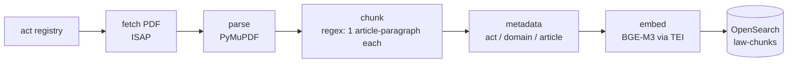
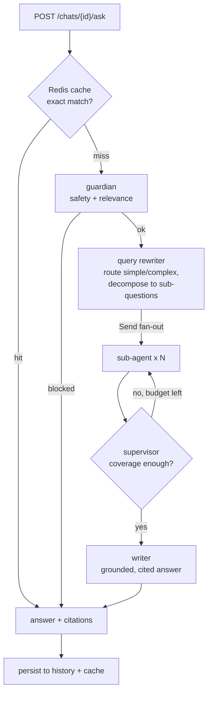
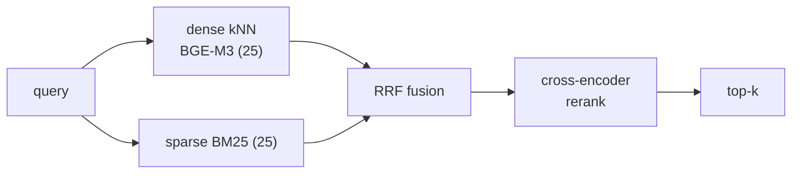

# Law-AI

Agentic RAG over **Polish law** — ask legal questions in English or Polish and
get grounded answers with **verbatim citations** to the source articles.
Covers civil, business, employment, tax and constitutional law, expanded
domain-by-domain from a single act registry.

- **Offline**: an Airflow pipeline fetches, parses, chunks and indexes each
  legal act into a hybrid (dense + sparse) OpenSearch index.
- **Online**: a LangGraph multi-agent pipeline classifies, decomposes,
  retrieves, reranks and writes cited answers — served over FastAPI with a
  Gradio chat UI, JWT auth, and per-user chat history.

See [ARCHITECTURE.md](ARCHITECTURE.md) for the full design.

---

## Corpus

~13,000 structure-aware chunks (one article-paragraph per chunk) across 5 domains:

| Domain | Acts (examples) |
|---|---|
| **civil** | Kodeks cywilny, tenant protection, apartment ownership, land & mortgage register |
| **business** | Kodeks spółek handlowych, Prawo przedsiębiorców, foreign entrepreneurs, KRS, CEIDG, accounting, unfair competition |
| **employment** | Kodeks pracy, social insurance (ZUS) |
| **tax** | VAT |
| **constitutional** | Konstytucja RP |

Adding an act = one entry in [`src/law_ai/acts.py`](src/law_ai/acts.py); the
per-domain DAG is generated automatically.

---

## Offline — ingestion pipeline

One DAG per domain (`ingest_<domain>`), generated from the act registry. Tasks
fan out over the domain's acts via dynamic task mapping; artifacts pass between
tasks as files (XCom carries act ids, never payloads). Indexing is idempotent
(deterministic chunk ids) — re-runs overwrite, never duplicate.



Trigger from the Airflow UI (http://localhost:8080) or run one act directly:
`uv run python airflow/ingest.py --act kodeks-cywilny`.

---

## Online — agentic query pipeline

An exact-match Redis cache short-circuits repeat questions; otherwise the
LangGraph graph runs. Retrieval, translation and generation are **injected
service calls** (deterministic), while the LLM drives **control flow**
(relevance gate, decomposition, fan-out width, supervisor loop).



Each **sub-agent** answers one sub-question autonomously: translate the query to
Polish (the corpus language) → hybrid retrieve → compress passages into citable
evidence. A self-check/refine loop exists but is currently config-gated off.

### Retrieval (inside `hybrid retrieve`)



Two legs fetch 25 candidates each → reciprocal-rank fusion → cross-encoder
rerank → top-k. Optional metadata filters (`article`, `domain`) pre-filter both
legs.

---

## API

| Method | Path | Purpose |
|---|---|---|
| `POST` | `/auth/register`, `/auth/login` | JWT auth |
| `GET` / `POST` | `/chats` | list / create chats |
| `GET` | `/chats/{id}/messages` | chat history |
| `DELETE` | `/chats/{id}` | delete chat |
| `POST` | `/chats/{id}/ask` | ask a legal question |
| `GET` | `/health` | liveness + DB check |

Gradio chat UI is mounted at `/ui`.

---

## Stack

FastAPI · Gradio · LangGraph · OpenSearch (hybrid + rerank) · Postgres ·
Redis (answer cache) · TEI (BGE-M3 embeddings) · cross-encoder reranker ·
Airflow · Langfuse (tracing) · Pydantic-Settings · uv · Docker

The LLM, embedding, reranker and translation models are **fully env-driven** —
nothing is hardcoded. Swap providers via `.env` (`LLM__*`, `EMBEDDING__*`, …).

---

## Quickstart

```bash
make install                 # uv sync  (make install-ml adds local reranker deps)
cp .env.example .env         # fill in LLM__*, EMBEDDING__*, RERANKER__*, ...
make up                      # postgres · opensearch · tei · redis · airflow
make migrate                 # db schema
make run                     # API + Gradio → http://localhost:8000/ui
```

Then build the index: open Airflow (http://localhost:8080, admin/admin) and
trigger a domain DAG (e.g. `ingest_civil`), or
`uv run python airflow/ingest.py --domain civil`.

---

## Configuration

Settings are grouped per service with env prefixes and read from `.env`
(see [`config.py`](src/law_ai/config.py)); every value is overridable:

```
APP__…  POSTGRES__…  OPENSEARCH__…  LLM__…  EMBEDDING__…  RERANKER__…
TRANSLATION__…  REDIS__…  LANGFUSE__…  S3__…  FETCHER__…
```

---

## Evaluation

A 105-question golden set (English questions → expected articles) drives
deterministic retrieval metrics, tracked as Langfuse experiments.

```bash
make eval-retrieval    # hit@k · recall@k · precision@k · MRR · nDCG@k → JSON report
make eval-ui           # render reports/*.json into an HTML dashboard
uv run python -m evaluation.runners.run_langfuse_experiment   # push to Langfuse
```

Baseline (BGE-M3 + bge-reranker-v2-m3, 105 questions): hit@5 ≈ 0.89,
recall@5 ≈ 0.87, MRR ≈ 0.80, nDCG@5 ≈ 0.81.

---

## Development

```bash
make lint          # ruff check + format check
make format        # auto-fix
make typecheck     # mypy (imports gradio first to generate its stubs)
make test          # unit tests
make test-integration   # needs `make up`
uv run pre-commit install
```

---

## Layout

```
src/law_ai/
  acts.py            # act registry (source of truth for ingestion)
  config.py          # env-driven settings, one block per service
  main.py            # FastAPI app + lifespan (builds & wires services)
  dependencies.py    # DI providers (settings, db, repos, RAG stack)
  routers/           # auth · chats · ask · health
  services/          # isolated capabilities (base/client/factory each):
                     #   chunking · pdf_parser · embedding · opensearch ·
                     #   reranker · translation · llm · cache · langfuse · agents
  services/agents/   # LangGraph graph + nodes (guardian … writer)
airflow/dags/        # per-domain ingestion DAG factory
evaluation/          # golden set, metrics, runners, HTML dashboard
docker/              # compose stack + Dockerfiles
```
